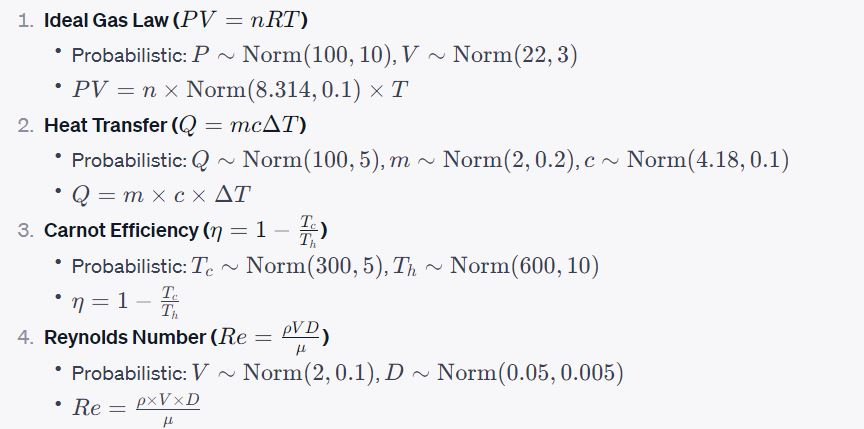
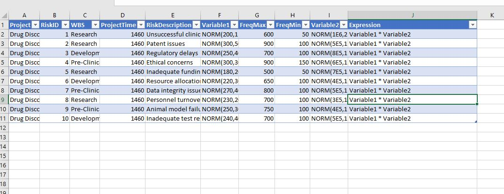
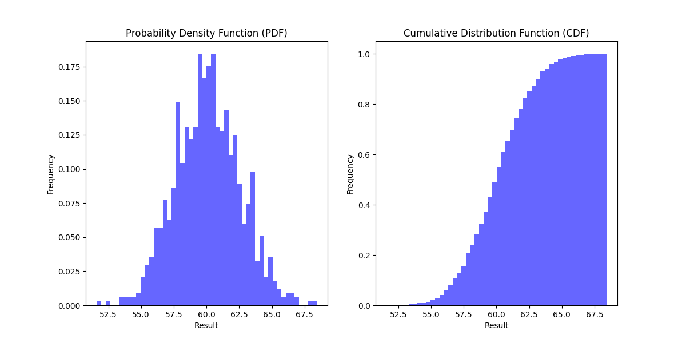

# Monte Carlo Planner
Simple, fast simulations in various domains. Whether you are in finance, engineering, or any other field that requires risk analysis or decision-making under uncertainty, this tool can be your ally. A simple way to run fast probabilistic complex scenarios and equation for example, probabilistic scenario for try running the following equations 

Built to handle complex multivariable scenarios, this simulation package simplifies tasks like risk assessment, capital budgeting, financial analysis, and reliability analysis. Simple Fast Simulation is designed to be versatile and fast, allowing users to solve complicated problems easily.

Features
Complex Multivariable Simulations: Allows for high-dimensional problems with multiple input variables and intricate dependencies.

Speed: Designed for performance, solving thousands or millions of scenarios in a short period.

Versatility: This can be adapted for various industries like finance for portfolio risk analysis, engineering for system reliability assessments, and more.

Ease-of-Use: Simple API and structure make it easy even for those not experts in simulation or the specific domain.

A. The solution can used using streamlit app to estimate a complex probabilistic expression, for example compute NORM(50,1) + NORM(50,1)

Run using the make file 
make streamlit

B. The solution can also be used directly with Excel, for example, the following example of a probabilistic risk analysis estimation exercise in Excel

In excel we can differentiate the way the variable are arranged either row-wise meaning each column will have different variables and column wise, like each row will have differtn variables

Run using the makefile the following. 

1. First update the location of file in make file
2. Run by using make file
3. make run-column-wise 
4. make run-row-wise

